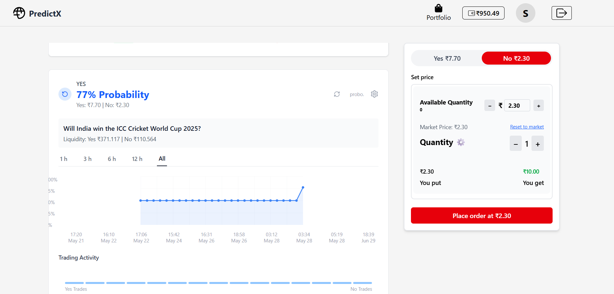

<div align="left" style="position: relative;">

<h1>PROBX-V1</h1>
<p align="left">
    <em><code>❯ A Prediction Market Platform for Trading Event Outcomes</code></em>
</p>
<p align="left">
    
    
    
    
</p>
<p align="left">
    
    
    
</p>
</div>
<br clear="right">

## 📍 Overview

PROBX-V1 is a prediction market platform where users can:

- Trade shares of event outcomes (like sports matches, elections, etc.)
- Buy/Sell contracts at dynamic market prices
- View real-time order books and price charts
- Manage portfolio of active positions
- Exit positions at any time with limit/market orders

The platform features a three-tier architecture:

1. **Frontend**: React-based trading interface
2. **Backend**: Node.js API with Prisma ORM
3. **Admin Panel**: For market management

## 👾 Core Features

### Trading Engine

- **Order Matching System**: First-in-first-out (FIFO) matching algorithm
- **Order Types**:
  - Market orders (immediate execution)
  - Limit orders (price-contingent)
  - Stop orders (exit triggers)
- **Order Book**: Real-time depth visualization
- **Price Prediction**: Algorithmic price forecasting

### User Experience

- **Portfolio Dashboard**: Track positions, P&L, and balance
- **Event Pages**: Detailed market information and charts
- **Responsive Design**: Mobile-friendly trading interface
- **Authentication**: Secure JWT-based login system

### Admin Features

- Event creation and management
- Market resolution and settlement
- User management and analytics

## 📸 Screenshots

### 🏠 Home Page


### 🔐 Auth Page


### 📋 Event Page


### Portfolio Page


### Probability Page



</p>
<p align="left">
	<!-- default option, no dependency badges. -->
</p>
</div>
<br clear="right">

<details><summary>Table of Contents</summary>

- [📍 Overview](#-overview)
- [👾 Features](#-features)
- [📁 Project Structure](#-project-structure)
  - [📂 Project Index](#-project-index)
- [🚀 Getting Started](#-getting-started)
  - [☑️ Prerequisites](#-prerequisites)
  - [⚙️ Installation](#-installation)
  - [🤖 Usage](#🤖-usage)
  - [🧪 Testing](#🧪-testing)
- [📌 Project Roadmap](#-project-roadmap)
- [🔰 Contributing](#-contributing)
- [🎗 License](#-license)
- [🙌 Acknowledgments](#-acknowledgments)

</details>
<hr>

## 📁 Project Structure

```sh
└── probX-V1/
    ├── README.md
    ├── admin-frontend
    │   ├── .gitignore
    │   ├── README.md
    │   ├── eslint.config.js
    │   ├── index.html
    │   ├── package-lock.json
    │   ├── package.json
    │   ├── public
    │   │   └── vite.svg
    │   ├── src
    │   │   ├── App.css
    │   │   ├── App.jsx
    │   │   ├── assets
    │   │   ├── components
    │   │   ├── index.css
    │   │   └── main.jsx
    │   └── vite.config.js
    ├── backend
    │   ├── .gitignore
    │   ├── app.js
    │   ├── controllers
    │   │   ├── admin_controller
    │   │   └── user_controller
    │   ├── db
    │   │   ├── .gitignore
    │   │   ├── db.js
    │   │   └── prisma
    │   ├── generated
    │   │   ├── client
    │   │   └── prisma
    │   ├── middleware
    │   │   ├── admin_middleware.js
    │   │   └── user_middleware.js
    │   ├── package-lock.json
    │   ├── package.json
    │   ├── routes
    │   │   ├── admin_routes
    │   │   └── user_routes
    │   └── utils
    │       ├── matchOrder.js
    │       ├── pridict_price.js
    │       └── updatePredictedPrices.js
    └── frontend
        ├── .gitignore
        ├── EventPage_Component
        │   ├── EventDetails.jsx
        │   ├── EventRules.jsx
        │   ├── OrderBook.jsx
        │   ├── OrderForm.jsx
        │   ├── PredictionChart.jsx
        │   └── ProbabilityChart.jsx
        ├── HomePage_Component
        │   ├── Cateogery.jsx
        │   └── HNavbar.jsx
        ├── README.md
        ├── components
        │   ├── AuthPage.jsx
        │   ├── EventPage.jsx
        │   ├── Exitcard.jsx
        │   ├── HomePage.jsx
        │   ├── LandingPage.jsx
        │   ├── Loader.jsx
        │   ├── Portfolio.jsx
        │   └── SellCard.jsx
        ├── eslint.config.js
        ├── index.html
        ├── landingPage_Component
        │   ├── CircularIcon.jsx
        │   ├── Faq.jsx
        │   ├── Feature2.jsx
        │   ├── Feature3.jsx
        │   ├── Features.jsx
        │   ├── Footer.jsx
        │   ├── Hero.jsx
        │   ├── Navbar.jsx
        │   ├── SocialLinks.jsx
        │   ├── care_comp
        │   └── read_comp
        ├── package-lock.json
        ├── package.json
        ├── public
        │   ├── img
        │   └── vite.svg
        ├── src
        │   ├── App.css
        │   ├── App.jsx
        │   ├── assets
        │   ├── index.css
        │   ├── main.jsx
        │   └── provider
        ├── utils.js
        └── vite.config.js
```

### 📂 Project Index

<details open>
	<summary><b><code>PROBX-V1/</code></b></summary>
	<details> <!-- __root__ Submodule -->
		<summary><b>__root__</b></summary>
		<blockquote>
			<table>
			</table>
		</blockquote>
	</details>
	<details> <!-- backend Submodule -->
		<summary><b>backend</b></summary>
		<blockquote>
			<table>
			<tr>
				<td><b><a href='https://github.com/Banti4750/probX-V1/blob/master/backend/app.js'>app.js</a></b></td>
				<td><code>❯ REPLACE-ME</code></td>
			</tr>
			<tr>
				<td><b><a href='https://github.com/Banti4750/probX-V1/blob/master/backend/package-lock.json'>package-lock.json</a></b></td>
				<td><code>❯ REPLACE-ME</code></td>
			</tr>
			<tr>
				<td><b><a href='https://github.com/Banti4750/probX-V1/blob/master/backend/package.json'>package.json</a></b></td>
				<td><code>❯ REPLACE-ME</code></td>
			</tr>
			</table>
			<details>
				<summary><b>controllers</b></summary>
				<blockquote>
					<details>
						<summary><b>user_controller</b></summary>
						<blockquote>
							<table>
							<tr>
								<td><b><a href='https://github.com/Banti4750/probX-V1/blob/master/backend/controllers/user_controller/prediction_controller.js'>prediction_controller.js</a></b></td>
								<td><code>❯ REPLACE-ME</code></td>
							</tr>
							<tr>
								<td><b><a href='https://github.com/Banti4750/probX-V1/blob/master/backend/controllers/user_controller/detail_controller.js'>detail_controller.js</a></b></td>
								<td><code>❯ REPLACE-ME</code></td>
							</tr>
							<tr>
								<td><b><a href='https://github.com/Banti4750/probX-V1/blob/master/backend/controllers/user_controller/events_controller.js'>events_controller.js</a></b></td>
								<td><code>❯ REPLACE-ME</code></td>
							</tr>
							<tr>
								<td><b><a href='https://github.com/Banti4750/probX-V1/blob/master/backend/controllers/user_controller/orderbook_controller.js'>orderbook_controller.js</a></b></td>
								<td><code>❯ REPLACE-ME</code></td>
							</tr>
							<tr>
								<td><b><a href='https://github.com/Banti4750/probX-V1/blob/master/backend/controllers/user_controller/auth_controller.js'>auth_controller.js</a></b></td>
								<td><code>❯ REPLACE-ME</code></td>
							</tr>
							<tr>
								<td><b><a href='https://github.com/Banti4750/probX-V1/blob/master/backend/controllers/user_controller/trade_controller.js'>trade_controller.js</a></b></td>
								<td><code>❯ REPLACE-ME</code></td>
							</tr>
							<tr>
								<td><b><a href='https://github.com/Banti4750/probX-V1/blob/master/backend/controllers/user_controller/faq_controller.js'>faq_controller.js</a></b></td>
								<td><code>❯ REPLACE-ME</code></td>
							</tr>
							</table>
						</blockquote>
					</details>
					<details>
						<summary><b>admin_controller</b></summary>
						<blockquote>
							<table>
							<tr>
								<td><b><a href='https://github.com/Banti4750/probX-V1/blob/master/backend/controllers/admin_controller/events_controller.js'>events_controller.js</a></b></td>
								<td><code>❯ REPLACE-ME</code></td>
							</tr>
							<tr>
								<td><b><a href='https://github.com/Banti4750/probX-V1/blob/master/backend/controllers/admin_controller/auth_controller.js'>auth_controller.js</a></b></td>
								<td><code>❯ REPLACE-ME</code></td>
							</tr>
							<tr>
								<td><b><a href='https://github.com/Banti4750/probX-V1/blob/master/backend/controllers/admin_controller/trade_controller.js'>trade_controller.js</a></b></td>
								<td><code>❯ REPLACE-ME</code></td>
							</tr>
							<tr>
								<td><b><a href='https://github.com/Banti4750/probX-V1/blob/master/backend/controllers/admin_controller/.js'>.js</a></b></td>
								<td><code>❯ REPLACE-ME</code></td>
							</tr>
							<tr>
								<td><b><a href='https://github.com/Banti4750/probX-V1/blob/master/backend/controllers/admin_controller/faq_controller.js'>faq_controller.js</a></b></td>
								<td><code>❯ REPLACE-ME</code></td>
							</tr>
							</table>
						</blockquote>
					</details>
				</blockquote>
			</details>
			<details>
				<summary><b>routes</b></summary>
				<blockquote>
					<details>
						<summary><b>admin_routes</b></summary>
						<blockquote>
							<table>
							<tr>
								<td><b><a href='https://github.com/Banti4750/probX-V1/blob/master/backend/routes/admin_routes/faq_routes.js'>faq_routes.js</a></b></td>
								<td><code>❯ REPLACE-ME</code></td>
							</tr>
							<tr>
								<td><b><a href='https://github.com/Banti4750/probX-V1/blob/master/backend/routes/admin_routes/trade_routes.js'>trade_routes.js</a></b></td>
								<td><code>❯ REPLACE-ME</code></td>
							</tr>
							<tr>
								<td><b><a href='https://github.com/Banti4750/probX-V1/blob/master/backend/routes/admin_routes/events.routes.js'>events.routes.js</a></b></td>
								<td><code>❯ REPLACE-ME</code></td>
							</tr>
							<tr>
								<td><b><a href='https://github.com/Banti4750/probX-V1/blob/master/backend/routes/admin_routes/auth_routes.js'>auth_routes.js</a></b></td>
								<td><code>❯ REPLACE-ME</code></td>
							</tr>
							</table>
						</blockquote>
					</details>
					<details>
						<summary><b>user_routes</b></summary>
						<blockquote>
							<table>
							<tr>
								<td><b><a href='https://github.com/Banti4750/probX-V1/blob/master/backend/routes/user_routes/events_routes.js'>events_routes.js</a></b></td>
								<td><code>❯ REPLACE-ME</code></td>
							</tr>
							<tr>
								<td><b><a href='https://github.com/Banti4750/probX-V1/blob/master/backend/routes/user_routes/pridiction_routes.js'>pridiction_routes.js</a></b></td>
								<td><code>❯ REPLACE-ME</code></td>
							</tr>
							<tr>
								<td><b><a href='https://github.com/Banti4750/probX-V1/blob/master/backend/routes/user_routes/faq_routes.js'>faq_routes.js</a></b></td>
								<td><code>❯ REPLACE-ME</code></td>
							</tr>
							<tr>
								<td><b><a href='https://github.com/Banti4750/probX-V1/blob/master/backend/routes/user_routes/orederbook_routes.js'>orederbook_routes.js</a></b></td>
								<td><code>❯ REPLACE-ME</code></td>
							</tr>
							<tr>
								<td><b><a href='https://github.com/Banti4750/probX-V1/blob/master/backend/routes/user_routes/details_routee.js'>details_routee.js</a></b></td>
								<td><code>❯ REPLACE-ME</code></td>
							</tr>
							<tr>
								<td><b><a href='https://github.com/Banti4750/probX-V1/blob/master/backend/routes/user_routes/trade_routes.js'>trade_routes.js</a></b></td>
								<td><code>❯ REPLACE-ME</code></td>
							</tr>
							<tr>
								<td><b><a href='https://github.com/Banti4750/probX-V1/blob/master/backend/routes/user_routes/auth_routes.js'>auth_routes.js</a></b></td>
								<td><code>❯ REPLACE-ME</code></td>
							</tr>
							</table>
						</blockquote>
					</details>
				</blockquote>
			</details>
			<details>
				<summary><b>utils</b></summary>
				<blockquote>
					<table>
					<tr>
						<td><b><a href='https://github.com/Banti4750/probX-V1/blob/master/backend/utils/updatePredictedPrices.js'>updatePredictedPrices.js</a></b></td>
						<td><code>❯ REPLACE-ME</code></td>
					</tr>
					<tr>
						<td><b><a href='https://github.com/Banti4750/probX-V1/blob/master/backend/utils/pridict_price.js'>pridict_price.js</a></b></td>
						<td><code>❯ REPLACE-ME</code></td>
					</tr>
					<tr>
						<td><b><a href='https://github.com/Banti4750/probX-V1/blob/master/backend/utils/matchOrder.js'>matchOrder.js</a></b></td>
						<td><code>❯ REPLACE-ME</code></td>
					</tr>
					</table>
				</blockquote>
			</details>
			<details>
				<summary><b>generated</b></summary>
				<blockquote>
					<details>
						<summary><b>prisma</b></summary>
						<blockquote>
							<table>
							<tr>
								<td><b><a href='https://github.com/Banti4750/probX-V1/blob/master/backend/generated/prisma/client.d.ts'>client.d.ts</a></b></td>
								<td><code>❯ REPLACE-ME</code></td>
							</tr>
							<tr>
								<td><b><a href='https://github.com/Banti4750/probX-V1/blob/master/backend/generated/prisma/default.js'>default.js</a></b></td>
								<td><code>❯ REPLACE-ME</code></td>
							</tr>
							<tr>
								<td><b><a href='https://github.com/Banti4750/probX-V1/blob/master/backend/generated/prisma/index-browser.js'>index-browser.js</a></b></td>
								<td><code>❯ REPLACE-ME</code></td>
							</tr>
							<tr>
								<td><b><a href='https://github.com/Banti4750/probX-V1/blob/master/backend/generated/prisma/edge.js'>edge.js</a></b></td>
								<td><code>❯ REPLACE-ME</code></td>
							</tr>
							<tr>
								<td><b><a href='https://github.com/Banti4750/probX-V1/blob/master/backend/generated/prisma/default.d.ts'>default.d.ts</a></b></td>
								<td><code>❯ REPLACE-ME</code></td>
							</tr>
							<tr>
								<td><b><a href='https://github.com/Banti4750/probX-V1/blob/master/backend/generated/prisma/index.d.ts'>index.d.ts</a></b></td>
								<td><code>❯ REPLACE-ME</code></td>
							</tr>
							<tr>
								<td><b><a href='https://github.com/Banti4750/probX-V1/blob/master/backend/generated/prisma/wasm.js'>wasm.js</a></b></td>
								<td><code>❯ REPLACE-ME</code></td>
							</tr>
							<tr>
								<td><b><a href='https://github.com/Banti4750/probX-V1/blob/master/backend/generated/prisma/client.js'>client.js</a></b></td>
								<td><code>❯ REPLACE-ME</code></td>
							</tr>
							<tr>
								<td><b><a href='https://github.com/Banti4750/probX-V1/blob/master/backend/generated/prisma/schema.prisma'>schema.prisma</a></b></td>
								<td><code>❯ REPLACE-ME</code></td>
							</tr>
							<tr>
								<td><b><a href='https://github.com/Banti4750/probX-V1/blob/master/backend/generated/prisma/index.js'>index.js</a></b></td>
								<td><code>❯ REPLACE-ME</code></td>
							</tr>
							<tr>
								<td><b><a href='https://github.com/Banti4750/probX-V1/blob/master/backend/generated/prisma/package.json'>package.json</a></b></td>
								<td><code>❯ REPLACE-ME</code></td>
							</tr>
							<tr>
								<td><b><a href='https://github.com/Banti4750/probX-V1/blob/master/backend/generated/prisma/edge.d.ts'>edge.d.ts</a></b></td>
								<td><code>❯ REPLACE-ME</code></td>
							</tr>
							<tr>
								<td><b><a href='https://github.com/Banti4750/probX-V1/blob/master/backend/generated/prisma/query_engine-windows.dll.node'>query_engine-windows.dll.node</a></b></td>
								<td><code>❯ REPLACE-ME</code></td>
							</tr>
							<tr>
								<td><b><a href='https://github.com/Banti4750/probX-V1/blob/master/backend/generated/prisma/wasm.d.ts'>wasm.d.ts</a></b></td>
								<td><code>❯ REPLACE-ME</code></td>
							</tr>
							</table>
							<details>
								<summary><b>runtime</b></summary>
								<blockquote>
									<table>
									<tr>
										<td><b><a href='https://github.com/Banti4750/probX-V1/blob/master/backend/generated/prisma/runtime/index-browser.js'>index-browser.js</a></b></td>
										<td><code>❯ REPLACE-ME</code></td>
									</tr>
									<tr>
										<td><b><a href='https://github.com/Banti4750/probX-V1/blob/master/backend/generated/prisma/runtime/library.js'>library.js</a></b></td>
										<td><code>❯ REPLACE-ME</code></td>
									</tr>
									<tr>
										<td><b><a href='https://github.com/Banti4750/probX-V1/blob/master/backend/generated/prisma/runtime/edge.js'>edge.js</a></b></td>
										<td><code>❯ REPLACE-ME</code></td>
									</tr>
									<tr>
										<td><b><a href='https://github.com/Banti4750/probX-V1/blob/master/backend/generated/prisma/runtime/index-browser.d.ts'>index-browser.d.ts</a></b></td>
										<td><code>❯ REPLACE-ME</code></td>
									</tr>
									<tr>
										<td><b><a href='https://github.com/Banti4750/probX-V1/blob/master/backend/generated/prisma/runtime/wasm.js'>wasm.js</a></b></td>
										<td><code>❯ REPLACE-ME</code></td>
									</tr>
									<tr>
										<td><b><a href='https://github.com/Banti4750/probX-V1/blob/master/backend/generated/prisma/runtime/react-native.js'>react-native.js</a></b></td>
										<td><code>❯ REPLACE-ME</code></td>
									</tr>
									<tr>
										<td><b><a href='https://github.com/Banti4750/probX-V1/blob/master/backend/generated/prisma/runtime/library.d.ts'>library.d.ts</a></b></td>
										<td><code>❯ REPLACE-ME</code></td>
									</tr>
									<tr>
										<td><b><a href='https://github.com/Banti4750/probX-V1/blob/master/backend/generated/prisma/runtime/edge-esm.js'>edge-esm.js</a></b></td>
										<td><code>❯ REPLACE-ME</code></td>
									</tr>
									</table>
								</blockquote>
							</details>
						</blockquote>
					</details>
					<details>
						<summary><b>client</b></summary>
						<blockquote>
							<table>
							<tr>
								<td><b><a href='https://github.com/Banti4750/probX-V1/blob/master/backend/generated/client/client.d.ts'>client.d.ts</a></b></td>
								<td><code>❯ REPLACE-ME</code></td>
							</tr>
							<tr>
								<td><b><a href='https://github.com/Banti4750/probX-V1/blob/master/backend/generated/client/default.js'>default.js</a></b></td>
								<td><code>❯ REPLACE-ME</code></td>
							</tr>
							<tr>
								<td><b><a href='https://github.com/Banti4750/probX-V1/blob/master/backend/generated/client/index-browser.js'>index-browser.js</a></b></td>
								<td><code>❯ REPLACE-ME</code></td>
							</tr>
							<tr>
								<td><b><a href='https://github.com/Banti4750/probX-V1/blob/master/backend/generated/client/edge.js'>edge.js</a></b></td>
								<td><code>❯ REPLACE-ME</code></td>
							</tr>
							<tr>
								<td><b><a href='https://github.com/Banti4750/probX-V1/blob/master/backend/generated/client/default.d.ts'>default.d.ts</a></b></td>
								<td><code>❯ REPLACE-ME</code></td>
							</tr>
							<tr>
								<td><b><a href='https://github.com/Banti4750/probX-V1/blob/master/backend/generated/client/index.d.ts'>index.d.ts</a></b></td>
								<td><code>❯ REPLACE-ME</code></td>
							</tr>
							<tr>
								<td><b><a href='https://github.com/Banti4750/probX-V1/blob/master/backend/generated/client/wasm.js'>wasm.js</a></b></td>
								<td><code>❯ REPLACE-ME</code></td>
							</tr>
							<tr>
								<td><b><a href='https://github.com/Banti4750/probX-V1/blob/master/backend/generated/client/client.js'>client.js</a></b></td>
								<td><code>❯ REPLACE-ME</code></td>
							</tr>
							<tr>
								<td><b><a href='https://github.com/Banti4750/probX-V1/blob/master/backend/generated/client/schema.prisma'>schema.prisma</a></b></td>
								<td><code>❯ REPLACE-ME</code></td>
							</tr>
							<tr>
								<td><b><a href='https://github.com/Banti4750/probX-V1/blob/master/backend/generated/client/libquery_engine-debian-openssl-3.0.x.so.node'>libquery_engine-debian-openssl-3.0.x.so.node</a></b></td>
								<td><code>❯ REPLACE-ME</code></td>
							</tr>
							<tr>
								<td><b><a href='https://github.com/Banti4750/probX-V1/blob/master/backend/generated/client/index.js'>index.js</a></b></td>
								<td><code>❯ REPLACE-ME</code></td>
							</tr>
							<tr>
								<td><b><a href='https://github.com/Banti4750/probX-V1/blob/master/backend/generated/client/package.json'>package.json</a></b></td>
								<td><code>❯ REPLACE-ME</code></td>
							</tr>
							<tr>
								<td><b><a href='https://github.com/Banti4750/probX-V1/blob/master/backend/generated/client/edge.d.ts'>edge.d.ts</a></b></td>
								<td><code>❯ REPLACE-ME</code></td>
							</tr>
							<tr>
								<td><b><a href='https://github.com/Banti4750/probX-V1/blob/master/backend/generated/client/query_engine-windows.dll.node'>query_engine-windows.dll.node</a></b></td>
								<td><code>❯ REPLACE-ME</code></td>
							</tr>
							<tr>
								<td><b><a href='https://github.com/Banti4750/probX-V1/blob/master/backend/generated/client/wasm.d.ts'>wasm.d.ts</a></b></td>
								<td><code>❯ REPLACE-ME</code></td>
							</tr>
							</table>
							<details>
								<summary><b>runtime</b></summary>
								<blockquote>
									<table>
									<tr>
										<td><b><a href='https://github.com/Banti4750/probX-V1/blob/master/backend/generated/client/runtime/index-browser.js'>index-browser.js</a></b></td>
										<td><code>❯ REPLACE-ME</code></td>
									</tr>
									<tr>
										<td><b><a href='https://github.com/Banti4750/probX-V1/blob/master/backend/generated/client/runtime/library.js'>library.js</a></b></td>
										<td><code>❯ REPLACE-ME</code></td>
									</tr>
									<tr>
										<td><b><a href='https://github.com/Banti4750/probX-V1/blob/master/backend/generated/client/runtime/edge.js'>edge.js</a></b></td>
										<td><code>❯ REPLACE-ME</code></td>
									</tr>
									<tr>
										<td><b><a href='https://github.com/Banti4750/probX-V1/blob/master/backend/generated/client/runtime/index-browser.d.ts'>index-browser.d.ts</a></b></td>
										<td><code>❯ REPLACE-ME</code></td>
									</tr>
									<tr>
										<td><b><a href='https://github.com/Banti4750/probX-V1/blob/master/backend/generated/client/runtime/wasm.js'>wasm.js</a></b></td>
										<td><code>❯ REPLACE-ME</code></td>
									</tr>
									<tr>
										<td><b><a href='https://github.com/Banti4750/probX-V1/blob/master/backend/generated/client/runtime/react-native.js'>react-native.js</a></b></td>
										<td><code>❯ REPLACE-ME</code></td>
									</tr>
									<tr>
										<td><b><a href='https://github.com/Banti4750/probX-V1/blob/master/backend/generated/client/runtime/library.d.ts'>library.d.ts</a></b></td>
										<td><code>❯ REPLACE-ME</code></td>
									</tr>
									<tr>
										<td><b><a href='https://github.com/Banti4750/probX-V1/blob/master/backend/generated/client/runtime/edge-esm.js'>edge-esm.js</a></b></td>
										<td><code>❯ REPLACE-ME</code></td>
									</tr>
									</table>
								</blockquote>
							</details>
						</blockquote>
					</details>
				</blockquote>
			</details>
			<details>
				<summary><b>middleware</b></summary>
				<blockquote>
					<table>
					<tr>
						<td><b><a href='https://github.com/Banti4750/probX-V1/blob/master/backend/middleware/admin_middleware.js'>admin_middleware.js</a></b></td>
						<td><code>❯ REPLACE-ME</code></td>
					</tr>
					<tr>
						<td><b><a href='https://github.com/Banti4750/probX-V1/blob/master/backend/middleware/user_middleware.js'>user_middleware.js</a></b></td>
						<td><code>❯ REPLACE-ME</code></td>
					</tr>
					</table>
				</blockquote>
			</details>
			<details>
				<summary><b>db</b></summary>
				<blockquote>
					<table>
					<tr>
						<td><b><a href='https://github.com/Banti4750/probX-V1/blob/master/backend/db/db.js'>db.js</a></b></td>
						<td><code>❯ REPLACE-ME</code></td>
					</tr>
					</table>
					<details>
						<summary><b>prisma</b></summary>
						<blockquote>
							<table>
							<tr>
								<td><b><a href='https://github.com/Banti4750/probX-V1/blob/master/backend/db/prisma/schema.prisma'>schema.prisma</a></b></td>
								<td><code>❯ REPLACE-ME</code></td>
							</tr>
							</table>
							<details>
								<summary><b>migrations</b></summary>
								<blockquote>
									<table>
									<tr>
										<td><b><a href='https://github.com/Banti4750/probX-V1/blob/master/backend/db/prisma/migrations/migration_lock.toml'>migration_lock.toml</a></b></td>
										<td><code>❯ REPLACE-ME</code></td>
									</tr>
									</table>
									<details>
										<summary><b>20250521171729_</b></summary>
										<blockquote>
											<table>
											<tr>
												<td><b><a href='https://github.com/Banti4750/probX-V1/blob/master/backend/db/prisma/migrations/20250521171729_/migration.sql'>migration.sql</a></b></td>
												<td><code>❯ REPLACE-ME</code></td>
											</tr>
											</table>
										</blockquote>
									</details>
									<details>
										<summary><b>20250521122753_</b></summary>
										<blockquote>
											<table>
											<tr>
												<td><b><a href='https://github.com/Banti4750/probX-V1/blob/master/backend/db/prisma/migrations/20250521122753_/migration.sql'>migration.sql</a></b></td>
												<td><code>❯ REPLACE-ME</code></td>
											</tr>
											</table>
										</blockquote>
									</details>
									<details>
										<summary><b>20250521173018_</b></summary>
										<blockquote>
											<table>
											<tr>
												<td><b><a href='https://github.com/Banti4750/probX-V1/blob/master/backend/db/prisma/migrations/20250521173018_/migration.sql'>migration.sql</a></b></td>
												<td><code>❯ REPLACE-ME</code></td>
											</tr>
											</table>
										</blockquote>
									</details>
									<details>
										<summary><b>20250514111055_</b></summary>
										<blockquote>
											<table>
											<tr>
												<td><b><a href='https://github.com/Banti4750/probX-V1/blob/master/backend/db/prisma/migrations/20250514111055_/migration.sql'>migration.sql</a></b></td>
												<td><code>❯ REPLACE-ME</code></td>
											</tr>
											</table>
										</blockquote>
									</details>
									<details>
										<summary><b>20250515033457_</b></summary>
										<blockquote>
											<table>
											<tr>
												<td><b><a href='https://github.com/Banti4750/probX-V1/blob/master/backend/db/prisma/migrations/20250515033457_/migration.sql'>migration.sql</a></b></td>
												<td><code>❯ REPLACE-ME</code></td>
											</tr>
											</table>
										</blockquote>
									</details>
									<details>
										<summary><b>20250510172741_remove_role</b></summary>
										<blockquote>
											<table>
											<tr>
												<td><b><a href='https://github.com/Banti4750/probX-V1/blob/master/backend/db/prisma/migrations/20250510172741_remove_role/migration.sql'>migration.sql</a></b></td>
												<td><code>❯ REPLACE-ME</code></td>
											</tr>
											</table>
										</blockquote>
									</details>
									<details>
										<summary><b>20250510203028_</b></summary>
										<blockquote>
											<table>
											<tr>
												<td><b><a href='https://github.com/Banti4750/probX-V1/blob/master/backend/db/prisma/migrations/20250510203028_/migration.sql'>migration.sql</a></b></td>
												<td><code>❯ REPLACE-ME</code></td>
											</tr>
											</table>
										</blockquote>
									</details>
									<details>
										<summary><b>20250520114338_</b></summary>
										<blockquote>
											<table>
											<tr>
												<td><b><a href='https://github.com/Banti4750/probX-V1/blob/master/backend/db/prisma/migrations/20250520114338_/migration.sql'>migration.sql</a></b></td>
												<td><code>❯ REPLACE-ME</code></td>
											</tr>
											</table>
										</blockquote>
									</details>
									<details>
										<summary><b>20250520120118_</b></summary>
										<blockquote>
											<table>
											<tr>
												<td><b><a href='https://github.com/Banti4750/probX-V1/blob/master/backend/db/prisma/migrations/20250520120118_/migration.sql'>migration.sql</a></b></td>
												<td><code>❯ REPLACE-ME</code></td>
											</tr>
											</table>
										</blockquote>
									</details>
									<details>
										<summary><b>20250511002255_</b></summary>
										<blockquote>
											<table>
											<tr>
												<td><b><a href='https://github.com/Banti4750/probX-V1/blob/master/backend/db/prisma/migrations/20250511002255_/migration.sql'>migration.sql</a></b></td>
												<td><code>❯ REPLACE-ME</code></td>
											</tr>
											</table>
										</blockquote>
									</details>
									<details>
										<summary><b>20250522092606_</b></summary>
										<blockquote>
											<table>
											<tr>
												<td><b><a href='https://github.com/Banti4750/probX-V1/blob/master/backend/db/prisma/migrations/20250522092606_/migration.sql'>migration.sql</a></b></td>
												<td><code>❯ REPLACE-ME</code></td>
											</tr>
											</table>
										</blockquote>
									</details>
									<details>
										<summary><b>20250510231048_</b></summary>
										<blockquote>
											<table>
											<tr>
												<td><b><a href='https://github.com/Banti4750/probX-V1/blob/master/backend/db/prisma/migrations/20250510231048_/migration.sql'>migration.sql</a></b></td>
												<td><code>❯ REPLACE-ME</code></td>
											</tr>
											</table>
										</blockquote>
									</details>
									<details>
										<summary><b>20250510170338_init</b></summary>
										<blockquote>
											<table>
											<tr>
												<td><b><a href='https://github.com/Banti4750/probX-V1/blob/master/backend/db/prisma/migrations/20250510170338_init/migration.sql'>migration.sql</a></b></td>
												<td><code>❯ REPLACE-ME</code></td>
											</tr>
											</table>
										</blockquote>
									</details>
								</blockquote>
							</details>
						</blockquote>
					</details>
				</blockquote>
			</details>
		</blockquote>
	</details>
	<details> <!-- admin-frontend Submodule -->
		<summary><b>admin-frontend</b></summary>
		<blockquote>
			<table>
			<tr>
				<td><b><a href='https://github.com/Banti4750/probX-V1/blob/master/admin-frontend/package-lock.json'>package-lock.json</a></b></td>
				<td><code>❯ REPLACE-ME</code></td>
			</tr>
			<tr>
				<td><b><a href='https://github.com/Banti4750/probX-V1/blob/master/admin-frontend/vite.config.js'>vite.config.js</a></b></td>
				<td><code>❯ REPLACE-ME</code></td>
			</tr>
			<tr>
				<td><b><a href='https://github.com/Banti4750/probX-V1/blob/master/admin-frontend/package.json'>package.json</a></b></td>
				<td><code>❯ REPLACE-ME</code></td>
			</tr>
			<tr>
				<td><b><a href='https://github.com/Banti4750/probX-V1/blob/master/admin-frontend/index.html'>index.html</a></b></td>
				<td><code>❯ REPLACE-ME</code></td>
			</tr>
			<tr>
				<td><b><a href='https://github.com/Banti4750/probX-V1/blob/master/admin-frontend/eslint.config.js'>eslint.config.js</a></b></td>
				<td><code>❯ REPLACE-ME</code></td>
			</tr>
			</table>
			<details>
				<summary><b>src</b></summary>
				<blockquote>
					<table>
					<tr>
						<td><b><a href='https://github.com/Banti4750/probX-V1/blob/master/admin-frontend/src/index.css'>index.css</a></b></td>
						<td><code>❯ REPLACE-ME</code></td>
					</tr>
					<tr>
						<td><b><a href='https://github.com/Banti4750/probX-V1/blob/master/admin-frontend/src/App.css'>App.css</a></b></td>
						<td><code>❯ REPLACE-ME</code></td>
					</tr>
					<tr>
						<td><b><a href='https://github.com/Banti4750/probX-V1/blob/master/admin-frontend/src/App.jsx'>App.jsx</a></b></td>
						<td><code>❯ REPLACE-ME</code></td>
					</tr>
					<tr>
						<td><b><a href='https://github.com/Banti4750/probX-V1/blob/master/admin-frontend/src/main.jsx'>main.jsx</a></b></td>
						<td><code>❯ REPLACE-ME</code></td>
					</tr>
					</table>
					<details>
						<summary><b>components</b></summary>
						<blockquote>
							<table>
							<tr>
								<td><b><a href='https://github.com/Banti4750/probX-V1/blob/master/admin-frontend/src/components/Faq.jsx'>Faq.jsx</a></b></td>
								<td><code>❯ REPLACE-ME</code></td>
							</tr>
							<tr>
								<td><b><a href='https://github.com/Banti4750/probX-V1/blob/master/admin-frontend/src/components/Dashboard.jsx'>Dashboard.jsx</a></b></td>
								<td><code>❯ REPLACE-ME</code></td>
							</tr>
							<tr>
								<td><b><a href='https://github.com/Banti4750/probX-V1/blob/master/admin-frontend/src/components/Event.jsx'>Event.jsx</a></b></td>
								<td><code>❯ REPLACE-ME</code></td>
							</tr>
							<tr>
								<td><b><a href='https://github.com/Banti4750/probX-V1/blob/master/admin-frontend/src/components/Auth.jsx'>Auth.jsx</a></b></td>
								<td><code>❯ REPLACE-ME</code></td>
							</tr>
							</table>
						</blockquote>
					</details>
				</blockquote>
			</details>
		</blockquote>
	</details>
	<details> <!-- frontend Submodule -->
		<summary><b>frontend</b></summary>
		<blockquote>
			<table>
			<tr>
				<td><b><a href='https://github.com/Banti4750/probX-V1/blob/master/frontend/package-lock.json'>package-lock.json</a></b></td>
				<td><code>❯ REPLACE-ME</code></td>
			</tr>
			<tr>
				<td><b><a href='https://github.com/Banti4750/probX-V1/blob/master/frontend/vite.config.js'>vite.config.js</a></b></td>
				<td><code>❯ REPLACE-ME</code></td>
			</tr>
			<tr>
				<td><b><a href='https://github.com/Banti4750/probX-V1/blob/master/frontend/utils.js'>utils.js</a></b></td>
				<td><code>❯ REPLACE-ME</code></td>
			</tr>
			<tr>
				<td><b><a href='https://github.com/Banti4750/probX-V1/blob/master/frontend/package.json'>package.json</a></b></td>
				<td><code>❯ REPLACE-ME</code></td>
			</tr>
			<tr>
				<td><b><a href='https://github.com/Banti4750/probX-V1/blob/master/frontend/index.html'>index.html</a></b></td>
				<td><code>❯ REPLACE-ME</code></td>
			</tr>
			<tr>
				<td><b><a href='https://github.com/Banti4750/probX-V1/blob/master/frontend/eslint.config.js'>eslint.config.js</a></b></td>
				<td><code>❯ REPLACE-ME</code></td>
			</tr>
			</table>
			<details>
				<summary><b>landingPage_Component</b></summary>
				<blockquote>
					<table>
					<tr>
						<td><b><a href='https://github.com/Banti4750/probX-V1/blob/master/frontend/landingPage_Component/Feature3.jsx'>Feature3.jsx</a></b></td>
						<td><code>❯ REPLACE-ME</code></td>
					</tr>
					<tr>
						<td><b><a href='https://github.com/Banti4750/probX-V1/blob/master/frontend/landingPage_Component/Navbar.jsx'>Navbar.jsx</a></b></td>
						<td><code>❯ REPLACE-ME</code></td>
					</tr>
					<tr>
						<td><b><a href='https://github.com/Banti4750/probX-V1/blob/master/frontend/landingPage_Component/Faq.jsx'>Faq.jsx</a></b></td>
						<td><code>❯ REPLACE-ME</code></td>
					</tr>
					<tr>
						<td><b><a href='https://github.com/Banti4750/probX-V1/blob/master/frontend/landingPage_Component/Footer.jsx'>Footer.jsx</a></b></td>
						<td><code>❯ REPLACE-ME</code></td>
					</tr>
					<tr>
						<td><b><a href='https://github.com/Banti4750/probX-V1/blob/master/frontend/landingPage_Component/Feature2.jsx'>Feature2.jsx</a></b></td>
						<td><code>❯ REPLACE-ME</code></td>
					</tr>
					<tr>
						<td><b><a href='https://github.com/Banti4750/probX-V1/blob/master/frontend/landingPage_Component/Hero.jsx'>Hero.jsx</a></b></td>
						<td><code>❯ REPLACE-ME</code></td>
					</tr>
					<tr>
						<td><b><a href='https://github.com/Banti4750/probX-V1/blob/master/frontend/landingPage_Component/Features.jsx'>Features.jsx</a></b></td>
						<td><code>❯ REPLACE-ME</code></td>
					</tr>
					<tr>
						<td><b><a href='https://github.com/Banti4750/probX-V1/blob/master/frontend/landingPage_Component/SocialLinks.jsx'>SocialLinks.jsx</a></b></td>
						<td><code>❯ REPLACE-ME</code></td>
					</tr>
					<tr>
						<td><b><a href='https://github.com/Banti4750/probX-V1/blob/master/frontend/landingPage_Component/CircularIcon.jsx'>CircularIcon.jsx</a></b></td>
						<td><code>❯ REPLACE-ME</code></td>
					</tr>
					</table>
					<details>
						<summary><b>care_comp</b></summary>
						<blockquote>
							<table>
							<tr>
								<td><b><a href='https://github.com/Banti4750/probX-V1/blob/master/frontend/landingPage_Component/care_comp/Carepage.jsx'>Carepage.jsx</a></b></td>
								<td><code>❯ REPLACE-ME</code></td>
							</tr>
							</table>
							<details>
								<summary><b>cares</b></summary>
								<blockquote>
									<table>
									<tr>
										<td><b><a href='https://github.com/Banti4750/probX-V1/blob/master/frontend/landingPage_Component/care_comp/cares/cares.html'>cares.html</a></b></td>
										<td><code>❯ REPLACE-ME</code></td>
									</tr>
									<tr>
										<td><b><a href='https://github.com/Banti4750/probX-V1/blob/master/frontend/landingPage_Component/care_comp/cares/section5.css'>section5.css</a></b></td>
										<td><code>❯ REPLACE-ME</code></td>
									</tr>
									<tr>
										<td><b><a href='https://github.com/Banti4750/probX-V1/blob/master/frontend/landingPage_Component/care_comp/cares/section6.css'>section6.css</a></b></td>
										<td><code>❯ REPLACE-ME</code></td>
									</tr>
									<tr>
										<td><b><a href='https://github.com/Banti4750/probX-V1/blob/master/frontend/landingPage_Component/care_comp/cares/section2.css'>section2.css</a></b></td>
										<td><code>❯ REPLACE-ME</code></td>
									</tr>
									<tr>
										<td><b><a href='https://github.com/Banti4750/probX-V1/blob/master/frontend/landingPage_Component/care_comp/cares/section4.css'>section4.css</a></b></td>
										<td><code>❯ REPLACE-ME</code></td>
									</tr>
									<tr>
										<td><b><a href='https://github.com/Banti4750/probX-V1/blob/master/frontend/landingPage_Component/care_comp/cares/section3.css'>section3.css</a></b></td>
										<td><code>❯ REPLACE-ME</code></td>
									</tr>
									<tr>
										<td><b><a href='https://github.com/Banti4750/probX-V1/blob/master/frontend/landingPage_Component/care_comp/cares/section1.css'>section1.css</a></b></td>
										<td><code>❯ REPLACE-ME</code></td>
									</tr>
									</table>
									<details>
										<summary><b>images</b></summary>
										<blockquote>
											<table>
											<tr>
												<td><b><a href='https://github.com/Banti4750/probX-V1/blob/master/frontend/landingPage_Component/care_comp/cares/images/membership_FICCI_image1.avif'>membership_FICCI_image1.avif</a></b></td>
												<td><code>❯ REPLACE-ME</code></td>
											</tr>
											<tr>
												<td><b><a href='https://github.com/Banti4750/probX-V1/blob/master/frontend/landingPage_Component/care_comp/cares/images/skilful_tile3_bg.avif'>skilful_tile3_bg.avif</a></b></td>
												<td><code>❯ REPLACE-ME</code></td>
											</tr>
											<tr>
												<td><b><a href='https://github.com/Banti4750/probX-V1/blob/master/frontend/landingPage_Component/care_comp/cares/images/read_more1.avif'>read_more1.avif</a></b></td>
												<td><code>❯ REPLACE-ME</code></td>
											</tr>
											<tr>
												<td><b><a href='https://github.com/Banti4750/probX-V1/blob/master/frontend/landingPage_Component/care_comp/cares/images/satyaveer_tile3.avif'>satyaveer_tile3.avif</a></b></td>
												<td><code>❯ REPLACE-ME</code></td>
											</tr>
											<tr>
												<td><b><a href='https://github.com/Banti4750/probX-V1/blob/master/frontend/landingPage_Component/care_comp/cares/images/satyaveer_tile1.avif'>satyaveer_tile1.avif</a></b></td>
												<td><code>❯ REPLACE-ME</code></td>
											</tr>
											<tr>
												<td><b><a href='https://github.com/Banti4750/probX-V1/blob/master/frontend/landingPage_Component/care_comp/cares/images/read_more2.avif'>read_more2.avif</a></b></td>
												<td><code>❯ REPLACE-ME</code></td>
											</tr>
											<tr>
												<td><b><a href='https://github.com/Banti4750/probX-V1/blob/master/frontend/landingPage_Component/care_comp/cares/images/membership_ASSOCHAM_image1.avif'>membership_ASSOCHAM_image1.avif</a></b></td>
												<td><code>❯ REPLACE-ME</code></td>
											</tr>
											<tr>
												<td><b><a href='https://github.com/Banti4750/probX-V1/blob/master/frontend/landingPage_Component/care_comp/cares/images/skilful_title1.avif'>skilful_title1.avif</a></b></td>
												<td><code>❯ REPLACE-ME</code></td>
											</tr>
											<tr>
												<td><b><a href='https://github.com/Banti4750/probX-V1/blob/master/frontend/landingPage_Component/care_comp/cares/images/rest_recharge_tile1_image1.avif'>rest_recharge_tile1_image1.avif</a></b></td>
												<td><code>❯ REPLACE-ME</code></td>
											</tr>
											<tr>
												<td><b><a href='https://github.com/Banti4750/probX-V1/blob/master/frontend/landingPage_Component/care_comp/cares/images/skilful_title5.avif'>skilful_title5.avif</a></b></td>
												<td><code>❯ REPLACE-ME</code></td>
											</tr>
											<tr>
												<td><b><a href='https://github.com/Banti4750/probX-V1/blob/master/frontend/landingPage_Component/care_comp/cares/images/skillscore_image1.avif'>skillscore_image1.avif</a></b></td>
												<td><code>❯ REPLACE-ME</code></td>
											</tr>
											<tr>
												<td><b><a href='https://github.com/Banti4750/probX-V1/blob/master/frontend/landingPage_Component/care_comp/cares/images/faq_bg.avif'>faq_bg.avif</a></b></td>
												<td><code>❯ REPLACE-ME</code></td>
											</tr>
											<tr>
												<td><b><a href='https://github.com/Banti4750/probX-V1/blob/master/frontend/landingPage_Component/care_comp/cares/images/satyaveer_bg.avif'>satyaveer_bg.avif</a></b></td>
												<td><code>❯ REPLACE-ME</code></td>
											</tr>
											<tr>
												<td><b><a href='https://github.com/Banti4750/probX-V1/blob/master/frontend/landingPage_Component/care_comp/cares/images/skilful_tile2_bg.avif'>skilful_tile2_bg.avif</a></b></td>
												<td><code>❯ REPLACE-ME</code></td>
											</tr>
											<tr>
												<td><b><a href='https://github.com/Banti4750/probX-V1/blob/master/frontend/landingPage_Component/care_comp/cares/images/horse_image.avif'>horse_image.avif</a></b></td>
												<td><code>❯ REPLACE-ME</code></td>
											</tr>
											<tr>
												<td><b><a href='https://github.com/Banti4750/probX-V1/blob/master/frontend/landingPage_Component/care_comp/cares/images/banner-background-img.avif'>banner-background-img.avif</a></b></td>
												<td><code>❯ REPLACE-ME</code></td>
											</tr>
											<tr>
												<td><b><a href='https://github.com/Banti4750/probX-V1/blob/master/frontend/landingPage_Component/care_comp/cares/images/satyaveer_tile2.avif'>satyaveer_tile2.avif</a></b></td>
												<td><code>❯ REPLACE-ME</code></td>
											</tr>
											<tr>
												<td><b><a href='https://github.com/Banti4750/probX-V1/blob/master/frontend/landingPage_Component/care_comp/cares/images/satyaveer_tile4.avif'>satyaveer_tile4.avif</a></b></td>
												<td><code>❯ REPLACE-ME</code></td>
											</tr>
											<tr>
												<td><b><a href='https://github.com/Banti4750/probX-V1/blob/master/frontend/landingPage_Component/care_comp/cares/images/academy_icon_image1.avif'>academy_icon_image1.avif</a></b></td>
												<td><code>❯ REPLACE-ME</code></td>
											</tr>
											<tr>
												<td><b><a href='https://github.com/Banti4750/probX-V1/blob/master/frontend/landingPage_Component/care_comp/cares/images/trust_safety_logo.avif'>trust_safety_logo.avif</a></b></td>
												<td><code>❯ REPLACE-ME</code></td>
											</tr>
											<tr>
												<td><b><a href='https://github.com/Banti4750/probX-V1/blob/master/frontend/landingPage_Component/care_comp/cares/images/rest_recharge_tile2_image1.avif'>rest_recharge_tile2_image1.avif</a></b></td>
												<td><code>❯ REPLACE-ME</code></td>
											</tr>
											<tr>
												<td><b><a href='https://github.com/Banti4750/probX-V1/blob/master/frontend/landingPage_Component/care_comp/cares/images/trust_safety_background.avif'>trust_safety_background.avif</a></b></td>
												<td><code>❯ REPLACE-ME</code></td>
											</tr>
											<tr>
												<td><b><a href='https://github.com/Banti4750/probX-V1/blob/master/frontend/landingPage_Component/care_comp/cares/images/read_more3.avif'>read_more3.avif</a></b></td>
												<td><code>❯ REPLACE-ME</code></td>
											</tr>
											</table>
										</blockquote>
									</details>
								</blockquote>
							</details>
						</blockquote>
					</details>
					<details>
						<summary><b>read_comp</b></summary>
						<blockquote>
							<table>
							<tr>
								<td><b><a href='https://github.com/Banti4750/probX-V1/blob/master/frontend/landingPage_Component/read_comp/Readpage.jsx'>Readpage.jsx</a></b></td>
								<td><code>❯ REPLACE-ME</code></td>
							</tr>
							</table>
							<details>
								<summary><b>read</b></summary>
								<blockquote>
									<table>
									<tr>
										<td><b><a href='https://github.com/Banti4750/probX-V1/blob/master/frontend/landingPage_Component/read_comp/read/section5.css'>section5.css</a></b></td>
										<td><code>❯ REPLACE-ME</code></td>
									</tr>
									<tr>
										<td><b><a href='https://github.com/Banti4750/probX-V1/blob/master/frontend/landingPage_Component/read_comp/read/section6.css'>section6.css</a></b></td>
										<td><code>❯ REPLACE-ME</code></td>
									</tr>
									<tr>
										<td><b><a href='https://github.com/Banti4750/probX-V1/blob/master/frontend/landingPage_Component/read_comp/read/section2.css'>section2.css</a></b></td>
										<td><code>❯ REPLACE-ME</code></td>
									</tr>
									<tr>
										<td><b><a href='https://github.com/Banti4750/probX-V1/blob/master/frontend/landingPage_Component/read_comp/read/section4.css'>section4.css</a></b></td>
										<td><code>❯ REPLACE-ME</code></td>
									</tr>
									<tr>
										<td><b><a href='https://github.com/Banti4750/probX-V1/blob/master/frontend/landingPage_Component/read_comp/read/section3.css'>section3.css</a></b></td>
										<td><code>❯ REPLACE-ME</code></td>
									</tr>
									<tr>
										<td><b><a href='https://github.com/Banti4750/probX-V1/blob/master/frontend/landingPage_Component/read_comp/read/section1.css'>section1.css</a></b></td>
										<td><code>❯ REPLACE-ME</code></td>
									</tr>
									<tr>
										<td><b><a href='https://github.com/Banti4750/probX-V1/blob/master/frontend/landingPage_Component/read_comp/read/read.html'>read.html</a></b></td>
										<td><code>❯ REPLACE-ME</code></td>
									</tr>
									</table>
									<details>
										<summary><b>image</b></summary>
										<blockquote>
											<table>
											<tr>
												<td><b><a href='https://github.com/Banti4750/probX-V1/blob/master/frontend/landingPage_Component/read_comp/read/image/world-cup-img .avif'>world-cup-img .avif</a></b></td>
												<td><code>❯ REPLACE-ME</code></td>
											</tr>
											<tr>
												<td><b><a href='https://github.com/Banti4750/probX-V1/blob/master/frontend/landingPage_Component/read_comp/read/image/story-2.avif'>story-2.avif</a></b></td>
												<td><code>❯ REPLACE-ME</code></td>
											</tr>
											<tr>
												<td><b><a href='https://github.com/Banti4750/probX-V1/blob/master/frontend/landingPage_Component/read_comp/read/image/story-1.avif'>story-1.avif</a></b></td>
												<td><code>❯ REPLACE-ME</code></td>
											</tr>
											<tr>
												<td><b><a href='https://github.com/Banti4750/probX-V1/blob/master/frontend/landingPage_Component/read_comp/read/image/story-3.avif'>story-3.avif</a></b></td>
												<td><code>❯ REPLACE-ME</code></td>
											</tr>
											<tr>
												<td><b><a href='https://github.com/Banti4750/probX-V1/blob/master/frontend/landingPage_Component/read_comp/read/image/image1.avif'>image1.avif</a></b></td>
												<td><code>❯ REPLACE-ME</code></td>
											</tr>
											<tr>
												<td><b><a href='https://github.com/Banti4750/probX-V1/blob/master/frontend/landingPage_Component/read_comp/read/image/startup-img.avif'>startup-img.avif</a></b></td>
												<td><code>❯ REPLACE-ME</code></td>
											</tr>
											<tr>
												<td><b><a href='https://github.com/Banti4750/probX-V1/blob/master/frontend/landingPage_Component/read_comp/read/image/news-1.avif'>news-1.avif</a></b></td>
												<td><code>❯ REPLACE-ME</code></td>
											</tr>
											<tr>
												<td><b><a href='https://github.com/Banti4750/probX-V1/blob/master/frontend/landingPage_Component/read_comp/read/image/news-3.avif'>news-3.avif</a></b></td>
												<td><code>❯ REPLACE-ME</code></td>
											</tr>
											<tr>
												<td><b><a href='https://github.com/Banti4750/probX-V1/blob/master/frontend/landingPage_Component/read_comp/read/image/news-2.avif'>news-2.avif</a></b></td>
												<td><code>❯ REPLACE-ME</code></td>
											</tr>
											</table>
										</blockquote>
									</details>
								</blockquote>
							</details>
						</blockquote>
					</details>
				</blockquote>
			</details>
			<details>
				<summary><b>src</b></summary>
				<blockquote>
					<table>
					<tr>
						<td><b><a href='https://github.com/Banti4750/probX-V1/blob/master/frontend/src/index.css'>index.css</a></b></td>
						<td><code>❯ REPLACE-ME</code></td>
					</tr>
					<tr>
						<td><b><a href='https://github.com/Banti4750/probX-V1/blob/master/frontend/src/App.css'>App.css</a></b></td>
						<td><code>❯ REPLACE-ME</code></td>
					</tr>
					<tr>
						<td><b><a href='https://github.com/Banti4750/probX-V1/blob/master/frontend/src/App.jsx'>App.jsx</a></b></td>
						<td><code>❯ REPLACE-ME</code></td>
					</tr>
					<tr>
						<td><b><a href='https://github.com/Banti4750/probX-V1/blob/master/frontend/src/main.jsx'>main.jsx</a></b></td>
						<td><code>❯ REPLACE-ME</code></td>
					</tr>
					</table>
					<details>
						<summary><b>provider</b></summary>
						<blockquote>
							<table>
							<tr>
								<td><b><a href='https://github.com/Banti4750/probX-V1/blob/master/frontend/src/provider/BalanceContext.jsx'>BalanceContext.jsx</a></b></td>
								<td><code>❯ REPLACE-ME</code></td>
							</tr>
							</table>
						</blockquote>
					</details>
				</blockquote>
			</details>
			<details>
				<summary><b>HomePage_Component</b></summary>
				<blockquote>
					<table>
					<tr>
						<td><b><a href='https://github.com/Banti4750/probX-V1/blob/master/frontend/HomePage_Component/Cateogery.jsx'>Cateogery.jsx</a></b></td>
						<td><code>❯ REPLACE-ME</code></td>
					</tr>
					<tr>
						<td><b><a href='https://github.com/Banti4750/probX-V1/blob/master/frontend/HomePage_Component/HNavbar.jsx'>HNavbar.jsx</a></b></td>
						<td><code>❯ REPLACE-ME</code></td>
					</tr>
					</table>
				</blockquote>
			</details>
			<details>
				<summary><b>components</b></summary>
				<blockquote>
					<table>
					<tr>
						<td><b><a href='https://github.com/Banti4750/probX-V1/blob/master/frontend/components/Exitcard.jsx'>Exitcard.jsx</a></b></td>
						<td><code>❯ REPLACE-ME</code></td>
					</tr>
					<tr>
						<td><b><a href='https://github.com/Banti4750/probX-V1/blob/master/frontend/components/SellCard.jsx'>SellCard.jsx</a></b></td>
						<td><code>❯ REPLACE-ME</code></td>
					</tr>
					<tr>
						<td><b><a href='https://github.com/Banti4750/probX-V1/blob/master/frontend/components/HomePage.jsx'>HomePage.jsx</a></b></td>
						<td><code>❯ REPLACE-ME</code></td>
					</tr>
					<tr>
						<td><b><a href='https://github.com/Banti4750/probX-V1/blob/master/frontend/components/EventPage.jsx'>EventPage.jsx</a></b></td>
						<td><code>❯ REPLACE-ME</code></td>
					</tr>
					<tr>
						<td><b><a href='https://github.com/Banti4750/probX-V1/blob/master/frontend/components/Portfolio.jsx'>Portfolio.jsx</a></b></td>
						<td><code>❯ REPLACE-ME</code></td>
					</tr>
					<tr>
						<td><b><a href='https://github.com/Banti4750/probX-V1/blob/master/frontend/components/LandingPage.jsx'>LandingPage.jsx</a></b></td>
						<td><code>❯ REPLACE-ME</code></td>
					</tr>
					<tr>
						<td><b><a href='https://github.com/Banti4750/probX-V1/blob/master/frontend/components/AuthPage.jsx'>AuthPage.jsx</a></b></td>
						<td><code>❯ REPLACE-ME</code></td>
					</tr>
					<tr>
						<td><b><a href='https://github.com/Banti4750/probX-V1/blob/master/frontend/components/Loader.jsx'>Loader.jsx</a></b></td>
						<td><code>❯ REPLACE-ME</code></td>
					</tr>
					</table>
				</blockquote>
			</details>
			<details>
				<summary><b>EventPage_Component</b></summary>
				<blockquote>
					<table>
					<tr>
						<td><b><a href='https://github.com/Banti4750/probX-V1/blob/master/frontend/EventPage_Component/EventDetails.jsx'>EventDetails.jsx</a></b></td>
						<td><code>❯ REPLACE-ME</code></td>
					</tr>
					<tr>
						<td><b><a href='https://github.com/Banti4750/probX-V1/blob/master/frontend/EventPage_Component/PredictionChart.jsx'>PredictionChart.jsx</a></b></td>
						<td><code>❯ REPLACE-ME</code></td>
					</tr>
					<tr>
						<td><b><a href='https://github.com/Banti4750/probX-V1/blob/master/frontend/EventPage_Component/ProbabilityChart.jsx'>ProbabilityChart.jsx</a></b></td>
						<td><code>❯ REPLACE-ME</code></td>
					</tr>
					<tr>
						<td><b><a href='https://github.com/Banti4750/probX-V1/blob/master/frontend/EventPage_Component/OrderBook.jsx'>OrderBook.jsx</a></b></td>
						<td><code>❯ REPLACE-ME</code></td>
					</tr>
					<tr>
						<td><b><a href='https://github.com/Banti4750/probX-V1/blob/master/frontend/EventPage_Component/OrderForm.jsx'>OrderForm.jsx</a></b></td>
						<td><code>❯ REPLACE-ME</code></td>
					</tr>
					<tr>
						<td><b><a href='https://github.com/Banti4750/probX-V1/blob/master/frontend/EventPage_Component/EventRules.jsx'>EventRules.jsx</a></b></td>
						<td><code>❯ REPLACE-ME</code></td>
					</tr>
					</table>
				</blockquote>
			</details>
		</blockquote>
	</details>
</details>

---

## 🚀 Getting Started

### ☑️ Prerequisites

Before getting started with probX-V1, ensure your runtime environment meets the following requirements:

- **Programming Language:** JavaScript
- **Package Manager:** Npm

### ⚙️ Installation

Install probX-V1 using one of the following methods:

**Build from source:**

1. Clone the probX-V1 repository:

```sh
❯ git clone https://github.com/Banti4750/probX-V1
```

2. Navigate to the project directory:

```sh
❯ cd probX-V1
```

3. Install the project dependencies:

**Using `npm`** &nbsp; [](https://www.npmjs.com/)

```sh
❯ npm install
```

### 🤖 Usage

Run probX-V1 using the following command:
**Using `npm`** &nbsp; [](https://www.npmjs.com/)

```sh
❯ npm start
```

### 🧪 Testing

Run the test suite using the following command:
**Using `npm`** &nbsp; [](https://www.npmjs.com/)

```sh
❯ npm test
```

---

## 📌 Project Roadmap

- [x] **`Task 1`**: <strike>Implement feature one.</strike>
- [ ] **`Task 2`**: Implement feature two.
- [ ] **`Task 3`**: Implement feature three.

---

## 🔰 Contributing

- **💬 [Join the Discussions](https://github.com/Banti4750/probX-V1/discussions)**: Share your insights, provide feedback, or ask questions.
- **🐛 [Report Issues](https://github.com/Banti4750/probX-V1/issues)**: Submit bugs found or log feature requests for the `probX-V1` project.
- **💡 [Submit Pull Requests](https://github.com/Banti4750/probX-V1/blob/main/CONTRIBUTING.md)**: Review open PRs, and submit your own PRs.

<details closed>
<summary>Contributing Guidelines</summary>

1. **Fork the Repository**: Start by forking the project repository to your github account.
2. **Clone Locally**: Clone the forked repository to your local machine using a git client.
   ```sh
   git clone https://github.com/Banti4750/probX-V1
   ```
3. **Create a New Branch**: Always work on a new branch, giving it a descriptive name.
   ```sh
   git checkout -b new-feature-x
   ```
4. **Make Your Changes**: Develop and test your changes locally.
5. **Commit Your Changes**: Commit with a clear message describing your updates.
   ```sh
   git commit -m 'Implemented new feature x.'
   ```
6. **Push to github**: Push the changes to your forked repository.
   ```sh
   git push origin new-feature-x
   ```
7. **Submit a Pull Request**: Create a PR against the original project repository. Clearly describe the changes and their motivations.
8. **Review**: Once your PR is reviewed and approved, it will be merged into the main branch. Congratulations on your contribution!
</details>

<details closed>
<summary>Contributor Graph</summary>
<br>
<p align="left">
   <a href="https://github.com{/Banti4750/probX-V1/}graphs/contributors">
      
   </a>
</p>
</details>

---

## 🎗 License

This project is protected under the [SELECT-A-LICENSE](https://choosealicense.com/licenses) License. For more details, refer to the [LICENSE](https://choosealicense.com/licenses/) file.

---

## 🙌 Acknowledgments

- List any resources, contributors, inspiration, etc. here.

---
